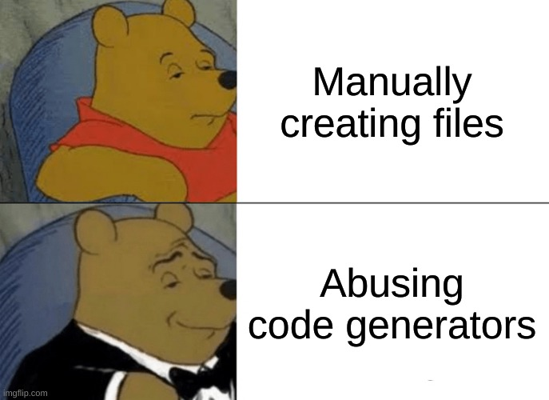
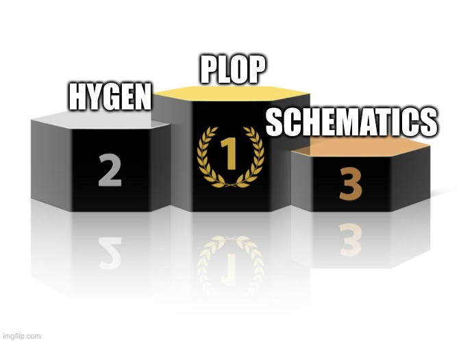

# Code generation tools comparison

This project aims to compare popular code generation tools in order to choose the tool that will be most optimal to reduce the amount of manual work needed during project development to create necessary files.

# What problems do we have?

1. We don't know how to add new code to the project. This situation occurs especially when we join a new project.
2. We do not know the rules of a given infrastructure. For example, when implementing [Domain Driven Design](https://martinfowler.com/bliki/DomainDrivenDesign.html), we have rules such as "Code from the domain layer should not depend on code from the application layer.".
3. We do not know what naming convention (e.g. `camelCase`, `PascalCase`, `kebab-case`, `plural form`, `singular form`) we should use in a given case. Each project has its own conventions for naming files, variables, functions, etc.
4. We forget to add the export statement to [barrel files](https://medium.com/@klauskpm/do-a-barrel-export-aa5b79b76b05). In the case of authoring libraries, this can cause serious problems for users, because they will not know from where to import declarations, and they may be forced to fix the imports if we later move the exports to barrel files or change the paths of the library files.
5. We forget to connect modules with their dependencies. For example, in Nest.js, we must remember to add dependencies to modules, otherwise they will not be available in the application for use.
6. We copy the code from one file to another and forget to update the names of all variable declarations and strings in the new file. Most often I encounter a situation where someone copies the test file (e.g. to save some time creating the test setup) and forgets to update mock names or test titles, because the tests pass correctly.

# Welcome, code generators!

Code generators are tools that take some kind of templates, commonly written in e.g. [ejs](https://ejs.co/) or [handlebars](https://handlebarsjs.com/), modify them accordingly to the options we give them, and add files to the filesystem at the declared paths.

We have several code generation tools available on the market, and I compared some of them in this repository. The code generation tools I found are:

- [plop](https://www.npmjs.com/package/plop)
- [hygen](https://www.npmjs.com/package/hygen)
- [@angular-devkit/schematics](https://www.npmjs.com/package/@angular-devkit/schematics) (+ complementary packages from angular ecosystem)

# Demo!

Let's imagine the following situations:

1. We want to create a file where we will store regular expressions for different date formats used in the application.
2. We want to add functionality in which the user will be able to change the password.
3. We want to create a module for managing user profiles.

Let's address these challenges using the `plop` generator:

1. Code generator options: `--name date-formats`.
2. Code generator options: `--name change-password --module users --method patch --path change-password`.
3. Code generator options: `--name user-profiles`.

# What do I expect from a code generator?

1. It **MUST** allow me to generate files from the templates that I will declare under the paths I want.
2. It **SHOULD** allow me to process existing files. Sometimes it happens that we need add constant declarations at the appropriate places in the file (e.g. providers array in Nest.js, reducers in redux), add import statements, add export statements (e.g. [barrel files](https://medium.com/@klauskpm/do-a-barrel-export-aa5b79b76b05)).
3. It **SHOULD** allow me to run interactive prompts that will allow to get an input from the user. Prompts are especially useful when we rarely use a particular generator or a new person is joining the project.
4. It **SHOULD** allow me to pass all arguments directly in the terminal. If I already know a generator, because I use it often, I don't need to run interactive prompts in the console.
5. It **SHOULD** allow me to validate user input. For example, I would like to force each user input to be in `kebab-case` format. Another example would be to force the user's input to match a specific regex (e.g. start with `use-`).
6. It **SHOULD** allow me to transform user input inside a template to different notations (e.g. `camelCase`,`pascalCase`, `constantCase`) or switch input between `plural` and `singular` forms.
7. It **SHOULD** allow me to run arbitrary code **before** or **after** generating the files. It may happen that the files generated from templates will not match our code formatting style (e.g. the lines in the generated file will be too long). In that case, I would like to run e.g. [prettier](https://prettier.io/) to format the code.

# Comparing code generation tools in a table

| Feature                                  | Plop                                                           | Hygen                                                   | Angular devkit                   |
| ---------------------------------------- | -------------------------------------------------------------- | ------------------------------------------------------- | -------------------------------- |
| Integration with existing project        | `plopfile.ts` in project root, template files wherever we want | everything in `_templates` directory in project root    | separate package in project root |
| Generate files based on templates        | ✅ (handlebars)                                                | ✅ (ejs)                                                | ✅ (custom)                      |
| Process already existing files           | ✅ (regex, AST)                                                | ✅ (regex)                                              | ✅ (regex, AST)                  |
| Run generators using interactive prompts | ✅ ([inquirer](https://www.npmjs.com/package/inquirer))        | ✅ ([enquirer](https://www.npmjs.com/package/enquirer)) | ✅ (custom)                      |
| Run generators using CLI                 | ✅                                                             | ✅                                                      | ✅                               |
| Validate user input                      | during prompts                                                 | during prompts                                          | after prompts                    |
| Transform user input                     | ✅ (10 built-in helpers)                                       | ✅ (32 built-in helpers)                                | ✅                               |
| Run arbitrary code                       | before, after                                                  | after                                                   | before, after                    |
| Write unit tests                         | ❌                                                             | ❌                                                      | ✅                               |
| Declare custom helpers                   | ✅                                                             | ❌                                                      | ✅                               |
| Documentation quality (**SUBJECTIVE**)   | 👍                                                             | 👍                                                      | 🙈 🙉 🙊                         |

# How long can it take to write such generators?

It took me about **5 hours and 20 minutes** to write generators in `plop`, in `hygen` it took me about **3 hours 40 minutes** and in `@angular-devkit/schematics` it took me **too long** (**about 4 hours**) to make satisfactory progress, and I got discouraged.

It took me about **1 hour and 40 minutes** longer to generate the code in `plop` than in `hygen`. The reason for this was definitely the fact that I started from integrating `plop`, so I did not have a good idea of what I really wanted to generate, and I also was making the most notes that I wanted to include in the conclusions. I would subjectively assess that writing in both libraries takes a similar amount of time.

# What problems could code generators cause?

1. There is a chance that someone will **NOT** use the generator and will create files manually, which will break the whole **consistency** assumption.
2. There is a chance that we will have to perform some actions after generating the code manually (e.g. running code formatter).
3. The reusability of the generators between projects is rather impossible. This is due to the fact that each project defines its own code development rules or uses different libraries.
4. Along with changes to the code structure in the project, we will have to remember to update the generators.
5. Probably something else that will come out only in more complicated projects.

# Conclusion

1. I cannot recommend the `@angular-devkit/schematics` package. To me, it seems too complicated for the use-cases I have, I had the most problems starting development with it, the documentation was not as helpful for me as the other 2 libraries.
2. The `plop` and `hygen` libraries provide similar features, and it is difficult for me to clearly define which one "is better". I put `plop` in the first place, because it allows me to enter 1 command (i.e.`yarn plop`) and run the CLI program, so I have fewer commands to remember than in the case of `hygen`.

# Resources

- [Angular schematics documentation.](https://angular.io/guide/schematics)
- [EJS engine documentation.](https://ejs.co/)
- [Handlebars engine documentation.](https://handlebarsjs.com/guide/)
- [Hygen library documentation.](http://www.hygen.io/docs/quick-start)
- [Inquirer library documentation.](https://github.com/SBoudrias/Inquirer.js)
- [Plop library documentation.](https://plopjs.com/documentation/#getting-started)
- [Website used to test regular expressions.](https://regexr.com/)
